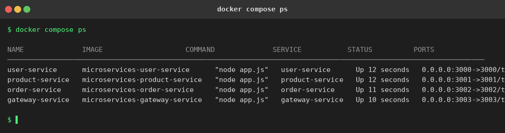
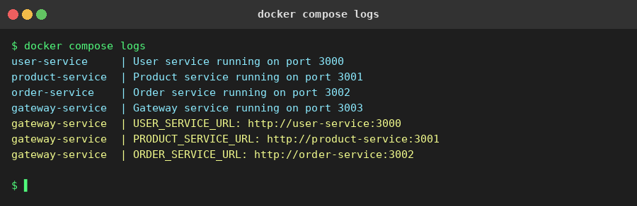
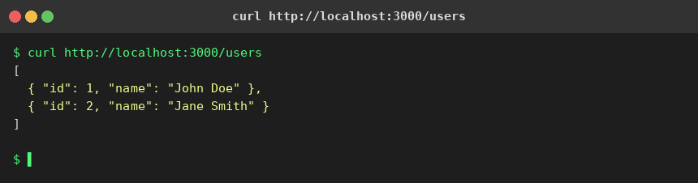
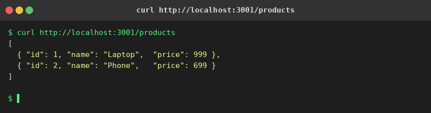
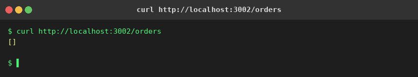
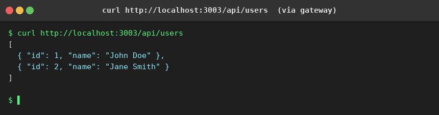
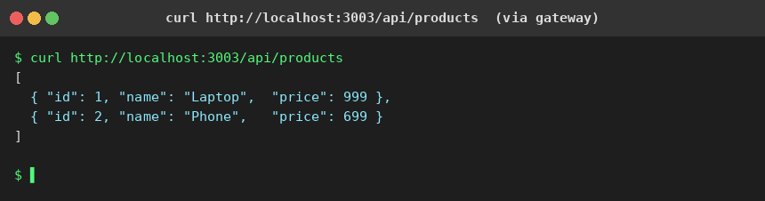
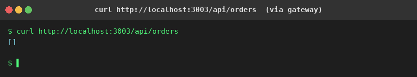

# Microservices Containerization Assessment

## Overview

This project containerizes four Node.js microservices using Docker and Docker Compose.

| Service | Port | Description |
|---------|------|-------------|
| user-service | 3000 | Returns user data |
| product-service | 3001 | Returns product catalog |
| order-service | 3002 | Manages orders |
| gateway-service | 3003 | API gateway routing to all services |

## Project Structure

```
Microservices/
├── user-service/
│   ├── Dockerfile
│   ├── .dockerignore
│   ├── app.js
│   └── package.json
├── product-service/
│   ├── Dockerfile
│   ├── .dockerignore
│   ├── app.js
│   └── package.json
├── order-service/
│   ├── Dockerfile
│   ├── .dockerignore
│   ├── app.js
│   └── package.json
├── gateway-service/
│   ├── Dockerfile
│   ├── .dockerignore
│   ├── app.js
│   └── package.json
└── docker-compose.yml
```

## Prerequisites

- [Docker](https://docs.docker.com/get-docker/) (v20+)
- [Docker Compose](https://docs.docker.com/compose/install/) (v2+)

## Setup Instructions

```bash
git clone https://github.com/2sagarrathore/Microservices-Task.git
cd Microservices-Task/Microservices
docker compose build
docker compose up -d
```

## How to Test Services

```bash
# Individual services
curl http://localhost:3000/users
curl http://localhost:3001/products
curl http://localhost:3002/orders

# Via gateway
curl http://localhost:3003/api/users
curl http://localhost:3003/api/products
curl http://localhost:3003/api/orders

# Health checks
curl http://localhost:3000/health
curl http://localhost:3001/health
curl http://localhost:3002/health
curl http://localhost:3003/health
```

## Useful Docker Commands

```bash
docker compose ps
docker compose logs
docker compose logs user-service
docker compose logs product-service
docker compose logs order-service
docker compose logs gateway-service
docker compose down
docker compose up --build
```

## Troubleshooting

- **Port already in use**: Stop the existing process or change the host port in docker-compose.yml
- **Container exits immediately**: Check `docker compose logs <service-name>`
- **Gateway cannot reach services**: Ensure all containers are on `microservices-network`; gateway uses Docker service names, not `localhost`
- **Rebuild after changes**: Run `docker compose up --build`

## Screenshots

### 1. docker compose ps — all 4 containers running


### 2. docker compose logs — all services started


### 3. user-service — GET /users


### 4. product-service — GET /products


### 5. order-service — GET /orders


### 6. gateway — GET /api/users (proxied)


### 7. gateway — GET /api/products (proxied)


### 8. gateway — GET /api/orders (proxied)

